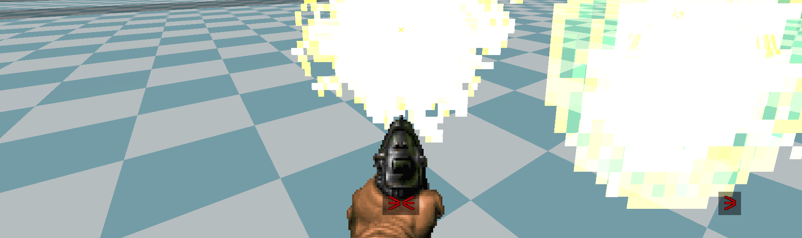

# Sound to Screen

Sound to Screen is an add-on for GZDoom games. It displays sounds on screen
depending on their position on the map.

It may be useful for people who play without sound or people with hearing
impairment.

## Implementation Notes

- due to the way Sound to Screen works, it may reduce performance, especially on
  maps with high enemy count;
- doors and elevators that only wait to move are detected as producing
  sound. There is no way to detect this properly at the moment.

## Inspiration

- [Toby Accessibility Mod](https://forum.zdoom.org/viewtopic.php?f=4&t=71349) by Alando1.
- [Making Games Better for the Deaf and Hard of Hearing](https://youtu.be/4NGe4dzlukc) by Game Maker's Toolkit.

## Licensing

Author: m8f.

License: [GPLv3](copying.txt).
